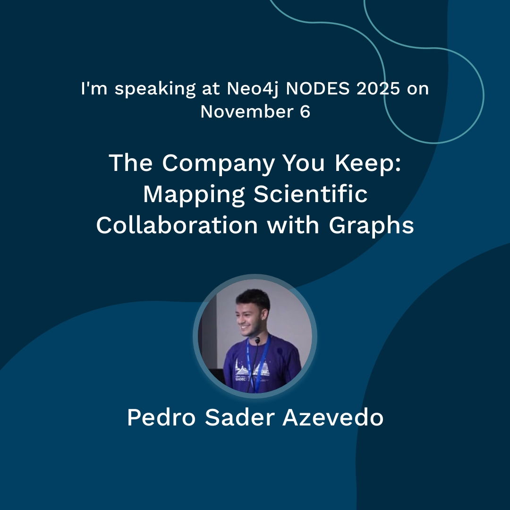
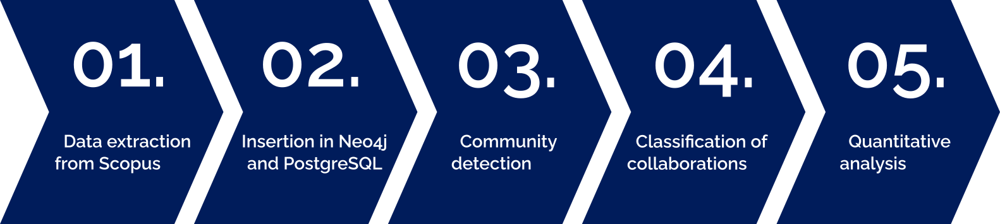
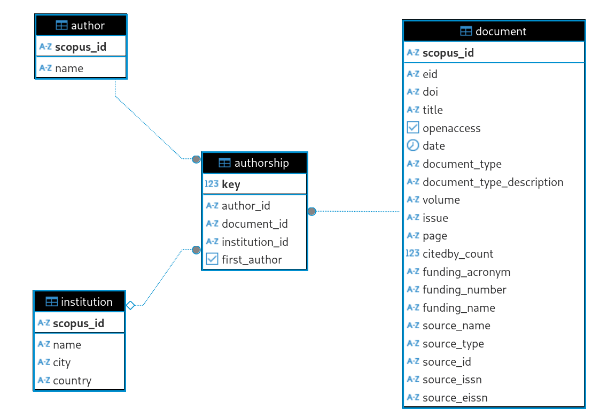
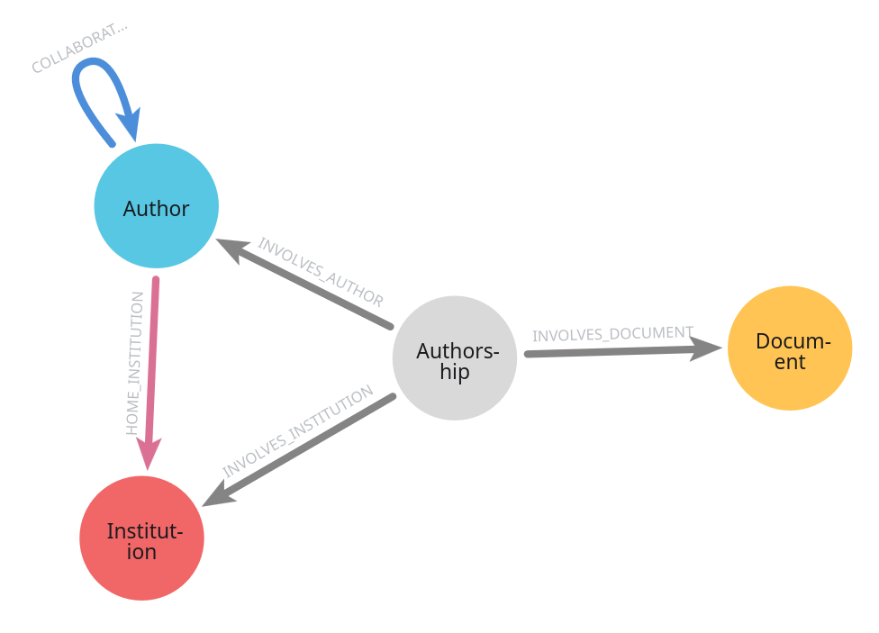
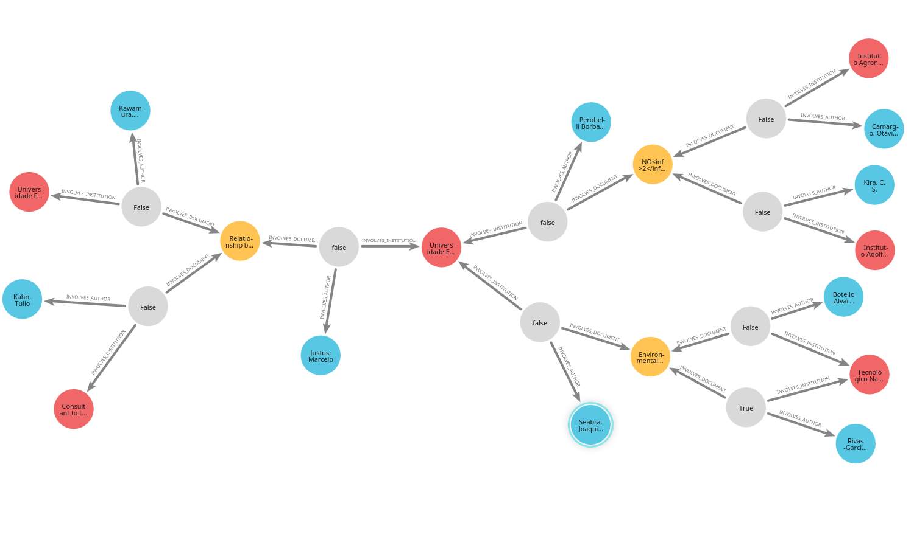
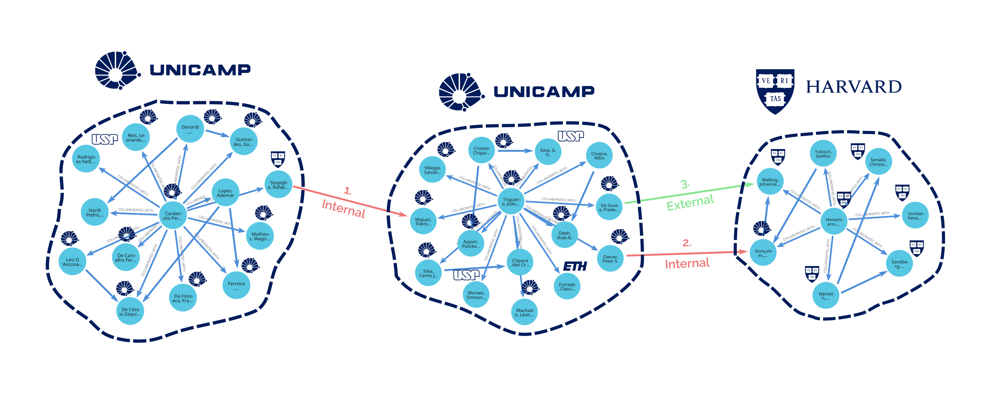
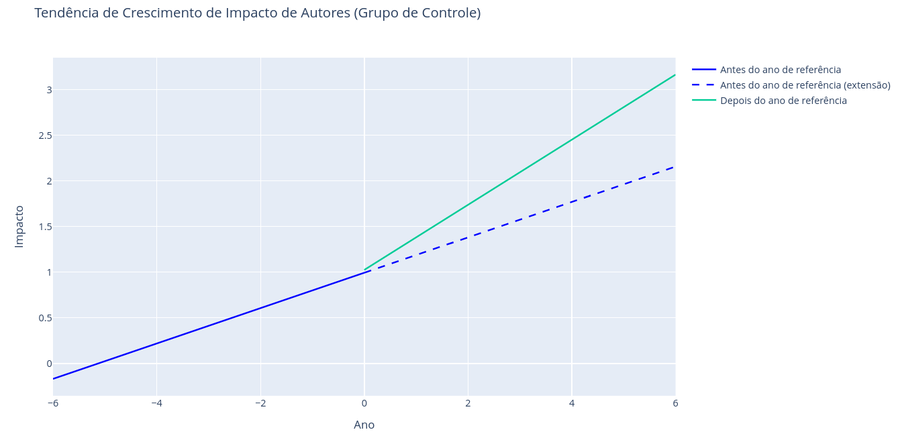
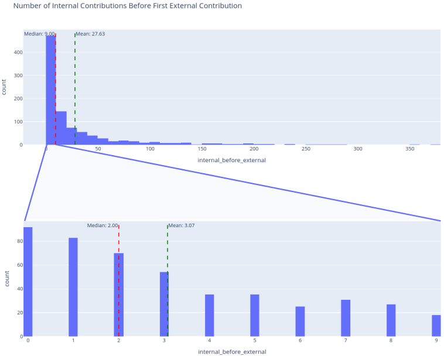

<h1> <code>graphology</code></h1>

  

An analysis of scientific collaboration networks at UNICAMP using graphs, powered by Neo4j.

## Good news!

`graphology` will be featured in a presentation at NODES 2025, Neo4j's annual conference.



## About

### Introduction

This project investigates how scientific collaborations affect researcher impact, offering insights that can inform public research funding policies and guide individual researcher strategies. It focuses on publications involving authors from the University of Campinas (UNICAMP), one of Brazil’s top academic institutions, and aims to evaluate the effect of an author’s first external collaboration on their cumulative citation count. The analysis draws on data from publications with at least one UNICAMP co-author, published between 2000 and 2025.

### Methods



We used public data from the Scopus database to create a scientific collaboration graph, which was stored using Neo4j. We ran community detection algorithms on this graph, so the results could be used to classify scientific collaborations as *internal* or *external*. Finally, we infered the influence of the first external collaboration on an author's number of citations using linear regressions.

### Implementation

To construct the scientific collaboration graph, public data from the Scopus was extracted using the [pybliometrics](https://pybliometrics.readthedocs.io/en/stable/) library. This data was processed and inserted into two databases: a relational database (PostgreSQL) and a graph database (Neo4j). The schema for both databases is shown below.

| PostgreSQL schema | Neo4j schema |
|-------------------|--------------|
|  |  |

The obtained graph had a total of 1,182,192 nodes and 5,610,615 edges (i.e. relationships). A sample of said graph is shown below, to help better understand its structure. It is color-coded exactly like the schema.

 

Neo4j played a key role not only in storing the graph, but also in offering highly optimized Implementations of graph algorithms that were needed for this research. One such algorithm was the Leiden algorithm for community detection. We ran it to identify "organic" communities of scientific collaboration inside and outside of UNICAMP. To each of these communities was attributed a predominant institution (i.e. the institution that the majority of authors in the community belong to). This data made it possible to classify collaborations as:

- Internal: a collaboration between an author from UNCAMP that belongs in an UNICAMP community with another author from UNICAMP who also belongs to an UNICAMP community.

- External: a collaboration between an author from UNCAMP that belongs in an UNICAMP community with an author **not** from UNICAMP who **doesn't** belong to an UNICAMP community.

We chose this criteria for external contributions, because it most accurately represented a significant expansion of a scientist's social network, as it expanded outside of its own institution on both individual (i.e. author affiliation) and collective (i.e. community affiliation) levels.

Let's see some examples in the image below.



1. *Internal*: Although one author is affiliated with Harvard, both authors belong in UNICAMP communities.
2. *Internal*: Although one author belongs in a Harvard communty, both authors are affiliated with UNICAMP.
3. *External*, One author is affiliated with UNICAMP and belongs in an UNICAMP community, while the other is affiliated with Harvard and belongs in a Harvard community.

Once the graph's edges were labeled as internal and external collaborations, we moved on to qualitative analysis. For that, we selected experimental and control groups from years 2005 to 2020, with the following characteristics:

**Control group**

- Never had external collaborations
- Published at least once that year
- Published at least once in previous years

**Experimental group**

- Had their first external collaboration that year
- Published at least once in previous years

For each group for each year, we gathered the total amount of citations five years before and five years after the analyzed year. Then, two linear regressions were ran for each author: before and after the analyzed year. We took an average of the coefficients of all authors to get the results shown below.

### Results

Contrary to the expectations, the control group (which did not have an external collaboration in the analyzed year) had a greater average increase in its slope. Meanwhile, the experimental group's changed very little.

| Control group results | Experimental group results |
|-------------------|--------------|
|  |  |

We believe this happened because external contributions tend to happen at a later stage in a scientist's career, as shown in the histogram below (shows the distributions of the number of internal collaborations before the first external collaboration). At that point, an author has likely already accumulated many citations, so its more difficult to get a significant relative increase to that metric.



There's are many outstanding research opportunities that we haven't been able to address in this project, such as applications in academic fraud flagging. Fortunately, all our code is open source, so any one can continue this work or use it for their own purposes (see [LICENSE](#license)).


### Further reading

You can read more about the `graphology` project (including references) in the links below.

- [Full report](https://drive.google.com/file/d/10F1xmM7sgJQiPOcEE9rL8TwXyaWAH8_q/view) (Brazilian Portuguese)
- [Poster](https://drive.google.com/file/d/1gLAYCwmBEwKAK8lMjpthRHyrUrIP3iYd/view) (Brazilian Portuguese)

## Running

### Relational Database

#### Setup

Set your password with

```sh
keyring set graphology-postgres admin
```

To run the database, use this command:

```sh
podman run -d \
  --name graphology-postgres \
  -e POSTGRES_PASSWORD=$(keyring get graphology-postgres admin) \
  -e POSTGRES_USER=admin \
  -e POSTGRES_DB=postgres \
  -v "$HOME/Documents/repos/pfg/.storage/" \
  -p 5432:5432 \
  --rm \
  --replace \
  postgres:latest
```

If you're running it inside an interactive container (i.e. a toolbx), run:

```sh
flatpak-spawn --host podman run -d \
  --name graphology-postgres \
  -e POSTGRES_PASSWORD=$(keyring get graphology-postgres admin) \
  -e POSTGRES_USER=admin \
  -e POSTGRES_DB=postgres \
  -v "$HOME/Documents/repos/pfg/.storage/" \
  -p 5432:5432 \
  --rm \
  --replace \
  postgres:latest
```

### Graph Database

#### Setup

These instructions are for Fedora Workstation, and based on the official
installation instructions laid out
[here](https://neo4j.com/docs/operations-manual/current/installation/linux/rpm/).

1. Install neo4j

Import the PGP key:

```sh
rpm --import https://debian.neo4j.com/neotechnology.gpg.key
```

Manually add the RPM repository:

```sh
sudo tee /etc/yum.repos.d/neo4j.repo > /dev/null <<EOF
[neo4j]
name=Neo4j RPM Repository
baseurl=https://yum.neo4j.com/stable/latest
enabled=1
gpgcheck=1
EOF
```

Install neo4j Community Edition:

```sh
sudo dnf install neo4j -y
```

2. Set initial password

```sh
sudo neo4j-admin dbms set-initial-password $YOUR_PASSWORD
```

3. Start neo4j

```sh
sudo neo4j start
```

#### Moving data to Neo4j's import directory

Neo4j requires files to be placed in a certain directory to import data from
them. For convenience, there's a small shell script that does that in
`scripts/cptsv.sh`. You can run it like so:

```sh
sudo ./scripts/cptsv.sh $TIMESTAMP
```

Where `$TIMESTAMP` is timestamp string, like "2025-05-10T17-44-35".

#### Resetting the `neo4j` database

To reset the database (clear all data in it), run:

```sh
sudo ./scripts/rmdb.sh
```

## License

This work is licensed under the terms of the GPLv3.
